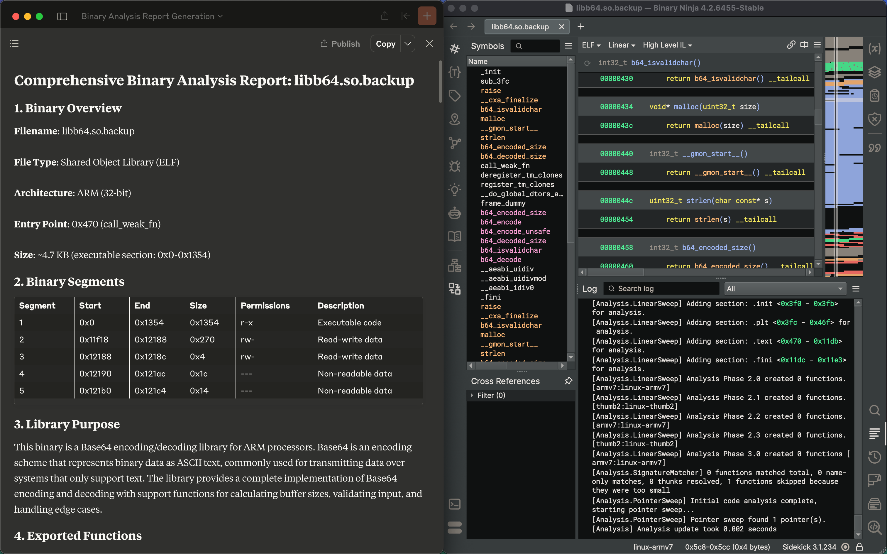

# Binary Ninja MCP

This repository contains a Binary Ninja plugin, MCP server, and bridge that enables seamless integration of Binary Ninja's capabilities with LLM assistance. While primarily tested as a Claude Desktop integration, the bridge can be used with other interfaces.

## Features

- Seamless, real-time integration between Binary Ninja and Claude
- Enhanced reverse engineering workflow with AI assistance
- Primary support for Claude Desktop, but extensible for other integrations

## Examples

### Generating a Binary Analysis Report


### Renaming Functions


## Supported Integrations

The following table details which integrations with Binary Ninja are currently supported.

| Function | Description |
|----------|-------------|
| `get_binary_status` | Get the current status of the loaded binary. |
| `list_classes` | List all namespace/class names in the program. |
| `list_data_items` | List defined data labels and their values. |
| `list_exports` | List exported functions/symbols. |
| `list_imports` | List imported symbols in the program. |
| `list_methods` | List all function names in the program. |
| `list_namespaces` | List all non-global namespaces in the program. |
| `list_segments` | List all memory segments in the program. |
| `rename_data` | Rename a data label at the specified address. |
| `rename_function` | Rename a function by its current name to a new user-defined name. |
| `search_functions_by_name` | Search for functions whose name contains the given substring. |
| `decompile_function` | Decompile a specific function by name and return the decompiled C code. |

## Prerequisites

- [Binary Ninja](https://binary.ninja/)
- Python 3.x
- [`uv` package manager](https://docs.astral.sh/uv/) (or your preferred Python package manager)
- [Claude Desktop](https://claude.ai/download) (for primary integration path)

## Installation

### 1. Clone the repository

```bash
git clone git@github.com:fosdickio/binary_ninja_mcp.git
cd binary_ninja_mcp
```

### 2. Install dependencies using `uv`

```bash
uv venv
source .venv/bin/activate  # On macOS/Linux
uv pip install -e .
```

### 3. For Claude Desktop integration (optional)

On macOS, you can run the following setup script:
```bash
python scripts/setup.py
```

On other platforms, in Claude Desktop, navigate to `Settings > Developer > Edit Config` and add the following:

```json
{
  "mcpServers": {
    "binaryninja_mcp": {
      "command": "uv",
      "args": [
        "--directory",
        "ABSOLUTE_PATH_TO_DIR/binary_ninja_mcp/src",
        "run",
        "binja_mcp_bridge.py"
      ]
    }
  }
}
```

This will configure Claude Desktop to work with the Binary Ninja MCP bridge and server.

## Usage

### Claude Desktop Integration

1. Launch Claude Desktop
2. Open Binary Ninja and install the `Binary Ninja MCP` plugin
3. In Binary Ninja, open a binary and start the MCP server (`Plugins > MCP Server > Start MCP Server`)
3. The integration will be automatically available when you interact with Claude Desktop

### Other Integration Paths
The bridge can be used with other interfaces by implementing the appropriate integration layer.

## Development

The project structure is organized as follows:

```
binary_ninja_mcp/
├── src/
│   ├── binja_mcp_bridge.py      # Main bridge implementation
├── scripts/
│   └── setup_claude_desktop.py  # Setup script for Claude Desktop
├── plugins/                     # Binary Ninja plugin
└── pyproject.toml               # Project configuration and dependencies
```

## Contributing

Contributions are welcome. Please feel free to submit a pull request.
